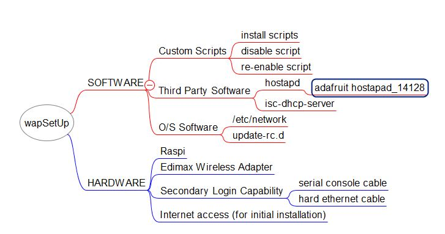

# wapSetUp
A set of Raspi wireless access point setup scripts to a) install and then optionally b) disable and optionally c) re-enable.  
Tested and worked with EDIMAX wireless adapter with Jesse Lite.
Based on information from:
[https://learn.adafruit.com/setting-up-a-raspberry-pi-as-a-wifi-access-point/overview](https://learn.adafruit.com/setting-up-a-raspberry-pi-as-a-wifi-access-point/overview)  
WARNING: NOT SECURE (NO WPA) AT THIS TIME

__TO USE INITIALLY (INSTALL FROM SCRATCH)__

0) Either connect to your pi via serial console or ensure both wireless AND
ethernet cable are connected.

1) Download this project's files to a directory on the pi, e.g. __`/home/pi/wapSetUp`__

2) Edit the __`init/hostapd.conf.hot`__ file and enter your preferred SSID; the default value is `wifi_fuzzy`

3) Edit the __`init/2_n2h_setHostIP.sh`__ file and set your preferred static/host
IP if defferent than the default value of `192.168.42.1`

4) Execute the `init/0_n2h_install.sh` script *AS SUDO*.
This will download and install hostapd and isc-dhcp-server.

5) Repeat for scripts 1 through 4.
These will set up/configure hostapd and isc-dhcp-server.

6) Run script 6, which will run hostapd and broadcast the SSID.
Test to see if you can connect to your pi's wireless access point
(the default SSID is `wifi_fuzzy` no password).  Try connecting, to it, for
example, from your phone, a tablet, a laptop or other client with a wireless capability.
If this does not work, don't bother going on to the next step.  You need to get this
working first.

7) Execute script 7 *as SUDO*.  This will start up the capability as a service. Check 
for any errors. If any unusual errors occur, don't bother going on to the next step. You
need to get this working first.

8) Execute script 8.  
This will set up the capability to start at boot up automatically.

9) Reboot

__TO DISABLE (FOR USE LATER- NO RE-INSTALLATION NEEDED):__

1) change to the install dir, e.g. `/home/pi/wapSetUp`

2) Execute the `disable_hot.sh` as SUDO

3) Reboot

__TO RE-ENABLE:__

1) change to the install dir, e.g. `/home/pi/wapSetUp`

2) Execute the `re_enable_hot.sh` as SUDO

3) Reboot

__MIND MAP__  

__References__
[https://learn.adafruit.com/setting-up-a-raspberry-pi-as-a-wifi-access-point/overview](https://learn.adafruit.com/setting-up-a-raspberry-pi-as-a-wifi-access-point/overview)

[https://www.raspberrypi.org/forums/viewtopic.php?f=28&t=152603](https://www.raspberrypi.org/forums/viewtopic.php?f=28&t=152603)
